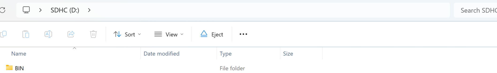
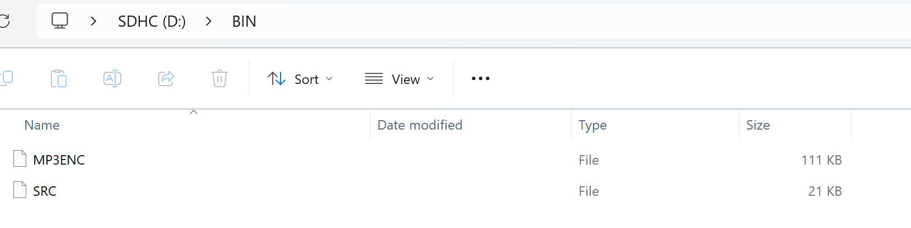

# Plant Distress Project

For testing ignore the batteries and use the cable for power and serial port access, so you can monitor for an issues.
Clone this repo. Each folder represents a different test. LogPicTimes will take pictures of the plants every couple of seconds, WAV recorder will record 10 inute bursts of plant audio, which you can chain and repeat to get as much audio as you want. 
Prior to running each test, you will need to ensure that the SD card is configured correctly. It should only have one folder, (/BIN).

 

Within that folder there should be two configurationn files, MP3ENC and SRC.

Please remove other files as they may have unintended consequences on data collection.
Finally, I did not configure the WAVrecorder to create different names for different wav files so remove the SD CARD after each run (you will be notified in the serial monitor), copy over the file, and delete it from the SD Card. In the large function with both parts, the WAV files have the same name as the Image but I did not implement that functionality in the WAVrecorder function, so it will always create a file named "Sound.wav".
